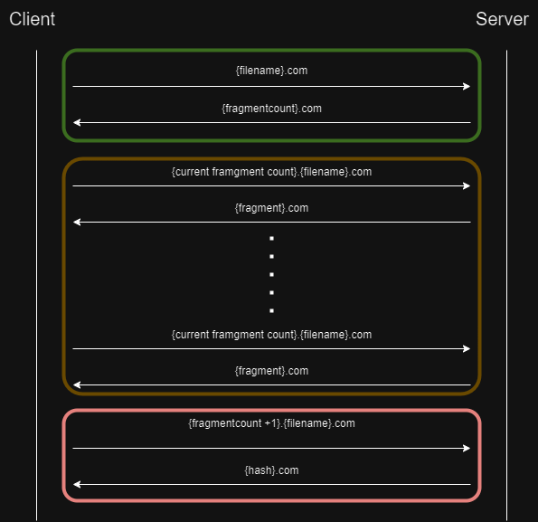

# NetworkSecurity
## Gruppennamen
- Samuel Amoah
- Yichen Zhang
- Pascal Weider
- Benedikt Gebauer
## Gewählte Anriffsmethode
Für die Erfüllung der Aufgabe wurde die Extraktion der Daten über DNS Requests gewählt
## Technische Beschreibung der Gegenmaßnahmen

### Phase 1 (grün)
In der ersten Phase schickt der Client eine DNS Anfrage an den Server mit dem qname: {filename}.com, der Client gibt dadurch an, für welche Datei er Informationen erhalten möchte. Um die Antwort zu generieren liest der Server die gewünschte Datei ein und codiert den Text in Base64. Die codierten Daten werden vom Server in 32 Zeichen große Fragment unterteilt. Das ist notwendig, da die größe eines DNS qnames begrenzt ist. Als Antwort schickt der Server eine DNS Antwort mit der Anzahl an Fragmenten die er zuvor unterteilt hat. Die Antwort besitzt daher folgenden qname: {fragmentcount}.com.
### Phase 2 (gelb) 
Die zweite Phase repräsentiert die eigentliche Datenübertragung. Dafür schickt der Client in jeder Itteration eine Anfrage mit dem qname: {current fragment count}.{filename}.com. Durch den filename wird angegeben welche Datei der Client haben möchte. Der current fragment count gibt an welches Fragment der Datei, der Client haben möchte. Als Antwort schickt der Server eine DNS Antwort mit dem qname: {data}.com. In Data wird der base64 codierten Text übertragen. 
Der Client ist dadurch in der Lage nach und nach alle Fragment des Textes anzufragen und zu empfangen. 
### Phase 3 (rot)
Die dritte Phase dient als Fehlerüberprüfung des vorherigen Datenaustausches. Dafür wird serverseitig ein Hash von dem base64 codierten Text generiert. Der Client geniert sich ebenfalls einen Hash der empfangenen Daten. Um den serverseitig generierten Hash abzufragen schickt der Client eine Anfrage mit dem qname: {fragmentcount+1}.com an den Server. Anschließend antwortet der Server mit einer DNS Antwort mit dem qname: {hash}.com. Der Client vergleicht den empfangenen und den selber genierten Hash. Dadurch kann festgestellt werden, ob bei der Datenübertragung ein Fehler aufgetreten ist. 
## Gewähltes Codierungsverfahren
Als Codierungsverfahren für die Daten wurde die Base64 Codierung gewählt. Die Base64-Codierung ist ein Verfahren zur Darstellung von Binärdaten in einem Textformat, das ausschließlich aus ASCII-Zeichen besteht. Es wird häufig verwendet, um Binärdaten wie Bilder, Audiodateien oder andere nicht-textbasierte Daten in Textformaten wie JSON oder XML zu übertragen, die normalerweise nur Text unterstützen.

Bei der Base64-Codierung werden 3 Byte (24 Bit) Binärdaten in eine Gruppe von 4 ASCII-Zeichen umgewandelt. Jedes ASCII-Zeichen repräsentiert dabei 6 Bits der ursprünglichen Daten. Falls die Länge der Eingabedaten nicht durch 3 teilbar ist, werden am Ende des Datenstroms Nullbytes hinzugefügt, und das letzte Zeichen in der Codierung wird mit dem '=' Zeichen aufgefüllt.
## Empfohlene Gegenmaßnahmen
Eine empfohlene Gegenmaßnahme ist das Analysieren der über das Netzwerk laufenden DNS Anfragen. Die von uns gewählte Angriffsmethode überträgt die Daten durch das Ersetzen des qnames einer DNS Anfrage. Es ist daher eine Möglichkeit die qnames von DNS Request zu betrachten und auf Muster von aufeinander Folgenden DNS Anfragen zu achten. Des Weiteren besitzen die von uns übertragenen qnames in der Regel die maximale Länge eines qnames, diese Verhalten ist untypisch für einen normalen DNS Traffic und kann daher als auffällig erkannt werden.

Eine weitere Möglichkeit ist das Limitieren von DNS Requests, bzw. Erkennen von einer hohen Anzahl an DNS Requests die gleichzeitig gesendet werden. Diese Gegenmaßnahme ist insbesondere effektiv, wenn eine große Menge an Daten über DNS Requests extrahiert wird. Durch das Erkennnen und ggf. Begrenzen von DNS Anfragen wird die Extraktion verlangsamt.
